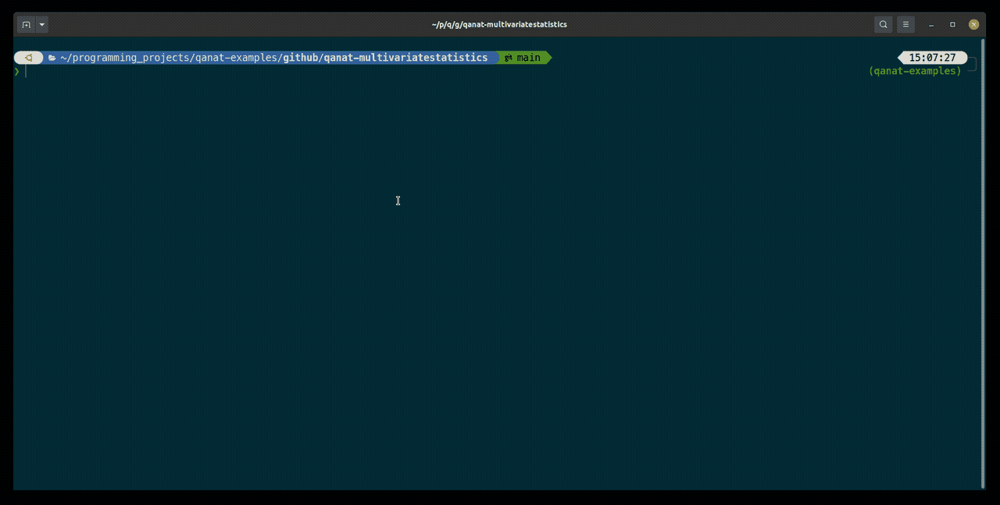
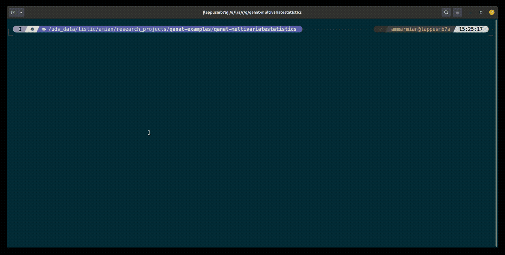

Features
================

Here we showcase some of the features of Qanat.

Experiment run tracking
-----------------------

* Automatic creation of experiment results directory
* Automatic logging of experiment parameters, git commit hash, stdout, stderr, etc.
* History of experiment runs with date, duration, description, tags, etc.

Ease of experiment running
--------------------------

* Launch experiments with a grid over parameters easily
* Facilitate run on job submission systems: HTCondor and Slurm
* Facilitate run on local machine of several parameters in parallel
* Facilitate run inside a container (Docker, Singularity)
* Track experiment progress

Dataset handling
----------------

* Track which dataset used for which experiment
* Automatically bind mount dataset directory inside container

Analysis of experiments results
-------------------------------

* Explore run of experiments by searching over details of experiment runs
* Analysis script after runs are finished can be formalised as actions on the experiment results

Documents handling
------------------

* Track documents relative to the project with tags, description, etc.
* Add experiment run dependencies on documents

Reproducibility
---------------

* Track git commit hash of the experiment code
* Reproduce experiment run from previous run in the same environment

Templates
---------

Many templates for different types of projects are available

* Simple python project
* Simple Matlab project
* Simple Julia project
* Multivariate Statistics project
* Deep Learning project
* etc.

Roadmap
=======
* [ ] Add support for Slurm
* [ ] Add support for Docker
* [ ] Add experiment to experiment dependencies
* [ ] Add hosts functionality to track different running machines
* [ ] Update document, experiments, dataset as an edit of YAML file

