Getting Started
===============
.. sectnum::

.. note::
    This tutorial is a quick introduction to Qanat. It is intended for people who
    are new to Qanat and want to get a feel for what it can do. It assumes that
    you have Qanat installed and working (see `installation <../../installation.html>`_
    for installation instructions).

.. note::
   The code for this tutorial is available at: https://github.com/AmmarMian/qanat-tutorials/tree/main/basics/getting_started

Objectives
----------

In this tutorial we build a simple experiment to compute the histogram of a
randomly generated array of numbers. We can define the seed of the random number
generator as a parameter of the experiment, and we can also define the number of
bins in the histogram as a parameter. The experiment will be run on a single
machine. This will be done using python with numpy library. We assume that python is installed on your
machine and available thanks to the `python` command.

.. note::
   Depending on your python installation, you may need to use ``python3`` instead of ``python``. Or alternatively, you can use an alias to your python executable:

   .. code-block:: console

        alias python=your/python/executable

Setting up the Qanat project
----------------------------

Let us first create a repertory for our project that we call ``histogram``:

.. code-block:: bash

   mkdir histogram
   cd histogram

We can then initialize the project with the ``qanat init`` command:

.. code-block:: bash

   qanat init .

After answering a few questions, this will create a ``.qanat/`` directory that contains
the configuration of the project in a file called ``config.yaml`` as well as a file ``database.db``
that contains the database of the project. The database is used to store the run history of the project.
Moreover, the directory is now a git repository, so you can use git to track the changes of your project.

You should have something like:

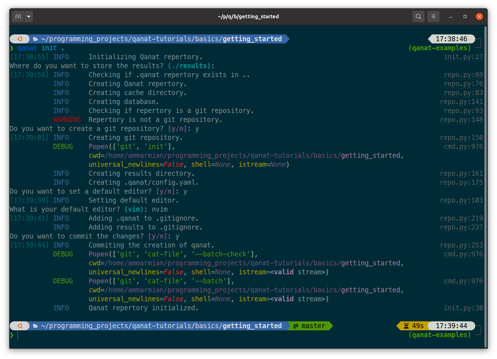

.. note::
    At this point, the project is empty, so the database is empty and the git repository has a single commit for
    the initialisation of the project. A ``.gitignore`` file has been created to ignore the ``.qanat/`` directory
    and the results directory.

.. note::
    The ``.qanat/`` directory is hidden by default. You can see it by using the ``-a`` option of the ``ls`` command.

    .. code-block:: console

       > ls -a
        ./  ../  experiments/  .git/  .gitignore  .qanat/  results/

Creating experiment script in python
------------------------------------

We can now create a python script that will contain the code of our experiment. In order to organise
better it is good practice to create a directory corresponding to the experiment and to put the script
in this directory. We can create the directory with the ``mkdir`` command:

.. code-block:: bash

   mkdir experiments

We can then create a file ``histogram.py`` in ``experiments`` with the following content:

.. code-block:: python

    import numpy as np
    import os
    import argparse

    if __name__ == "__main__":

         parser = argparse.ArgumentParser()
         parser.add_argument("--seed", type=int, default=0)
         parser.add_argument("--nbins", type=int, default=10)
         parser.add_argument("--storage_path", type=str, required=True)
         args = parser.parse_args()

         rng = np.random.RandomState(args.seed)
         data = rng.randn(1000)
         hist, bins = np.histogram(data, bins=args.nbins)

         results_path = os.path.join(args.storage_path, "results.npz")
         np.savez(results_path, hist=hist, bins=bins)

A simple script that use numpy library to generate a random array of numbers and compute the histogram.

The script takes three parameters: ``seed``, ``nbins`` and ``storage_path``. The first two parameters
are used to generate the data and compute the histogram. The third parameter is important as qanat use this
option to feed the script at which place it should store the results of the experiment.

To run the script without qanat, we can use the following command:

.. code-block:: bash

   python histogram.py --seed 0 --nbins 10 --storage_path .

This will generate a file ``result.npz`` in the current directory that contains the histogram and the bins. This is nice but we want Qanat to track the run of the experiment and save the parameters used for us.

Adding the experiment to the project
------------------------------------

We need to tell Qanat about the experiment. This is done thanks to the ``qanat experiment`` command. To
add a new experiment to the project, we can use the following command:

.. code-block:: bash

   qanat experiment new

This will show a prompt that will ask information about the experiment just like:

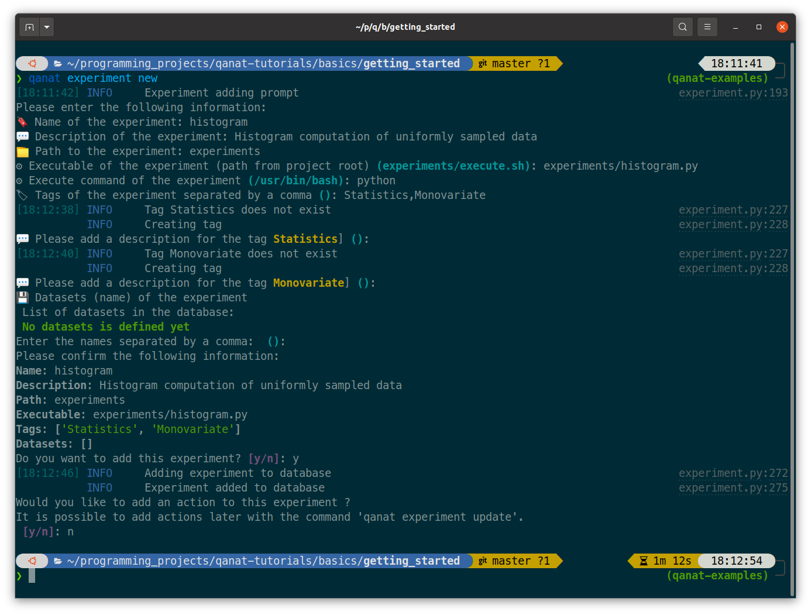

.. note::
   We have added a description of the experiment. This is optional but it is good practice to add a description
   as it will help you to remember what the experiment is about. We also added tags to the experiment.

.. note::
   Note that we didn't bother with the datasets and actions for now. We will see those later.

To check that Qanat has correctly added the experiment to the project, we can use the ``qanat experiment list`` command:

.. code-block:: bash

   qanat experiment list

which will output:

.. image:: ../../_static/tutorials/basics/histogram/qanat_experiment_list_illustration.png
   :width: 700px
   :align: center

Running the experiment
----------------------

Let us run the experiment again with the same parameters but by using Qanat thanks to
the ``qanat experiment run`` command:

.. code-block:: bash

   qanat experiment run histogram --seed 0 --nbins 10

This will tell you that the repertory is not committed to git and ask you if you want to commit it. You can answer ``y`` to this question. This will commit the repertory to git and run the experiment. The output of the command should be something like:

.. note::
   Qanat will refuse to run the experiment if the repertory is not committed to git. This is to avoid running experiments without knowing exactly which verison of the code was responsible of the result. The commit_sha of the
   running code is always stored. This is also useful to reproduce the results of the experiment.

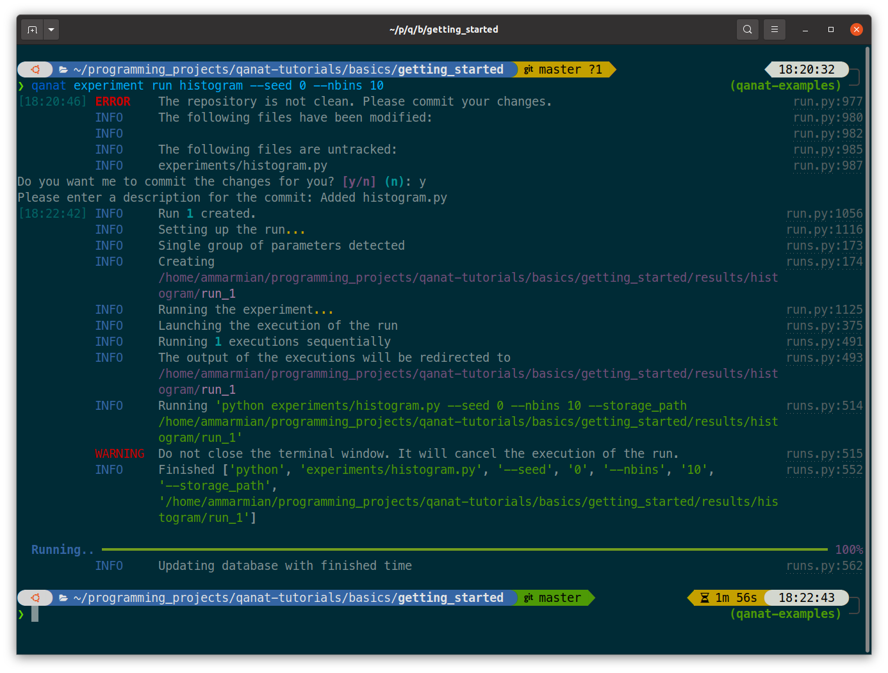

This will run the experiment and store the results in the ``results/histogram/run_1`` directory. The results
directory is created automatically by Qanat. The ``run_1`` directory is created by Qanat to store the results
of the first run of the experiment. If we run the experiment again, Qanat will create a ``run_2`` directory.
The standard output and standard error of the experiment are stored in the ``stdout.txt`` and ``stderr.txt`` in this
directory.

.. code-block:: console

    > tree results
     results/
     └── histogram
         └── run_1
             ├── group_info.yaml
             ├── info.yaml
             ├── results.npz
             ├── stderr.txt
             └── stdout.txt

     2 directories, 5 files

Note that Qanat has created a ``group_info.yaml`` file and an ``info.yaml`` file. The ``group_info.yaml`` file
contains information about the group of the experiment. We will see later how to use groups. The ``info.yaml`` file
contains information about the run of the experiment. This file is important for qanat to track run status of the experiment.

Plot the histogram
------------------

This is nice but we want to plot the histogram. To do that we introduce the notion of Action: this is a script
that will be run after the experiment. We can create an action with the ``qanat experiment update`` command.
Since we separated the computation from the plotting, we will need in this plot scrip to read the data and do the plotting. As for the execution scrip, an action script will need to parse the option ``--storage_path`` to know
where the results are stored. When Qanat will run the action, it will pass the path to the results directory to the action script.

First let's create a script ``plot_histogram.py`` in the ``experiments`` directory with the following content:

.. code:: python

    import numpy as np
    import matplotlib.pyplot as plt
    import argparse
    import os

    if __name__ == "__main__":

        parser = argparse.ArgumentParser()
        parser.add_argument("--storage_path", type=str, required=True)
        args = parser.parse_args()

        results_path = os.path.join(args.storage_path, "results.npz")
        results = np.load(results_path)
        hist = results["hist"]
        bins = results["bins"]

        plt.bar(bins[:-1], hist, width=bins[1] - bins[0])
        plt.savefig(os.path.join(args.storage_path, "histogram.png"))
        plt.show()

Now let's add the action to the experiment with the ``qanat experiment update`` command:

.. code-block:: bash

   qanat experiment update histogram

This will show a prompt that will allow to change actions. You will have something like:

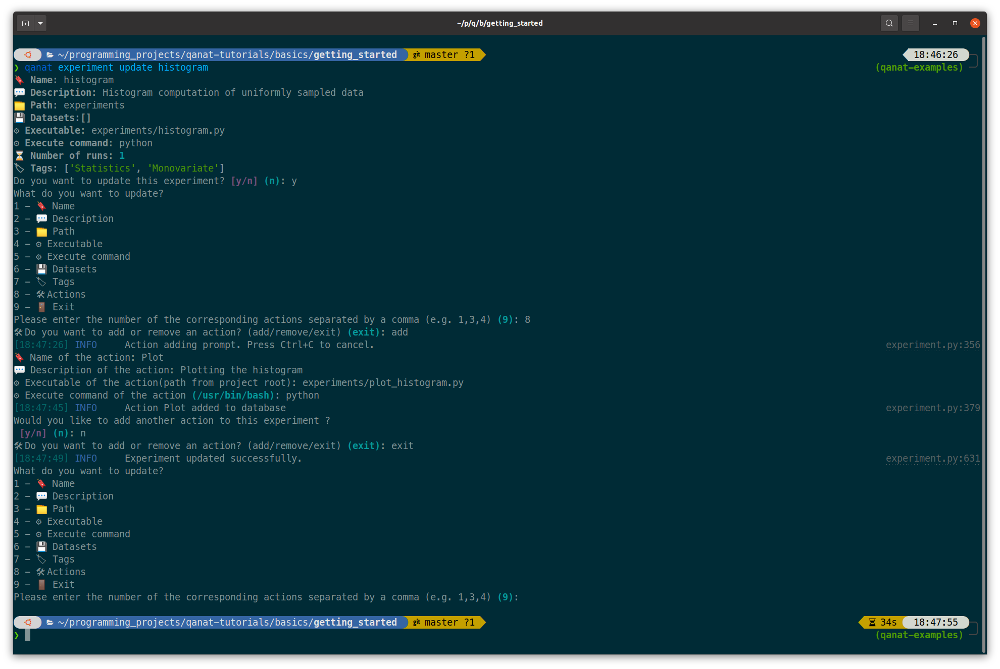

.. note::
   Note that we have added a description to the action. This is optional but it is good practice to add a description as it will help you to remember what the action is about.

Now we can execute the action thanks to Qanat using the command ``qanat experiment action``:

.. code-block:: bash

   qanat experiment action histogram Plot 1

.. note::
   We need to match exactly the name we gave to the action and precise on which run_id to execute the action on. Qanat will then get the path of the run and transfer to the action script.

This will run the action and store the results in the ``results/histogram/run_1`` directory (Since we have done so in the action script). This will also show the plot of the histogram if GUI is available:

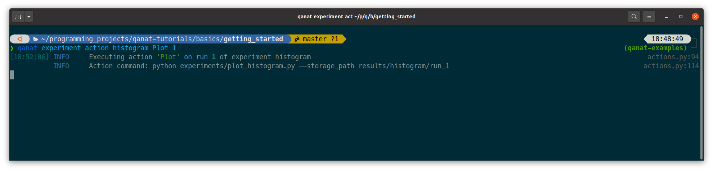

.. image:: ../../_static/tutorials/basics/histogram/qanat_action_Plot_matplotlib.png
   :width: 400px
   :align: center

Playing with the parameters
---------------------------

Now let's play with the parameters of the experiment. We can do that by using the ``qanat experiment run`` command. A special option allows to run the same experiment with different values of parameters. This is called a Group. For example let's play on the number of bins:

.. code-block:: bash

   qanat experiment run histogram --seed 0 -g "--nbins 10" -g "--nbins 20" -g "--nbins 30"

That will produce the following output:

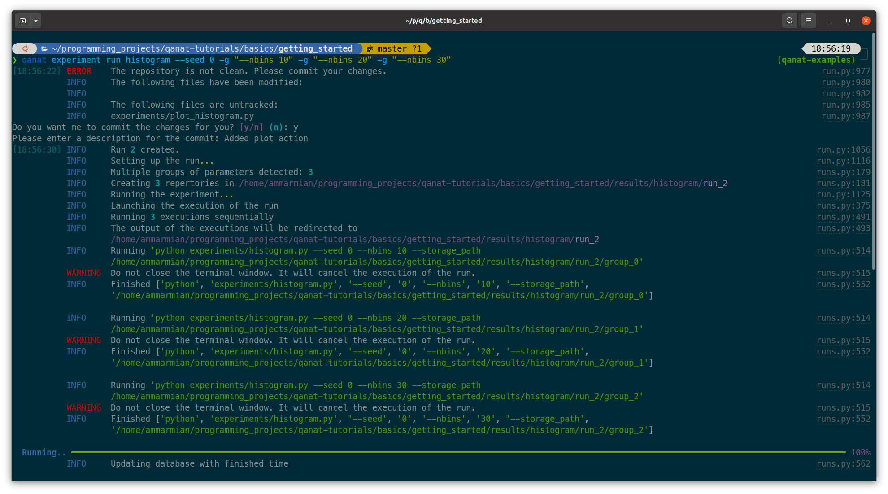

This will run the experiment with 3 different values of ``nbins``. The results will be stored in the ``results/histogram/run_2/group_0``, ``results/histogram/run_2/group_1`` and ``results/histogram/run_2/group_2``. The ``group_info.yaml`` will have the information on the run parameters for the group. The files are organised as follows:

.. code-block:: console

    > tree results
     results/
     └── histogram
         ...
         └── run_2
             ├── group_0
             │   ├── group_info.yaml
             │   ├── info.yaml
             │   ├── results.npz
             │   ├── stderr.txt
             │   └── stdout.txt
             ├── group_1
             │   ├── group_info.yaml
             │   ├── info.yaml
             │   ├── results.npz
             │   ├── stderr.txt
             │   └── stdout.txt
             └── group_2
                 ├── group_info.yaml
                 ├── info.yaml
                 ├── results.npz
                 ├── stderr.txt
                 └── stdout.txt

     4 directories, 15 files

The problem now is that the ``plot_histogram.py`` script doesn't deal with groups. We need to modify it to deal with groups or when doing the action we can use a special option ``--group_no`` that will run the action with ``storage_path`` to the path corresponding to a specific group:

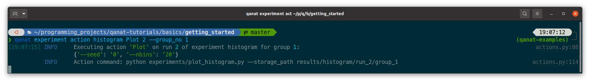

that will produce the following figures:

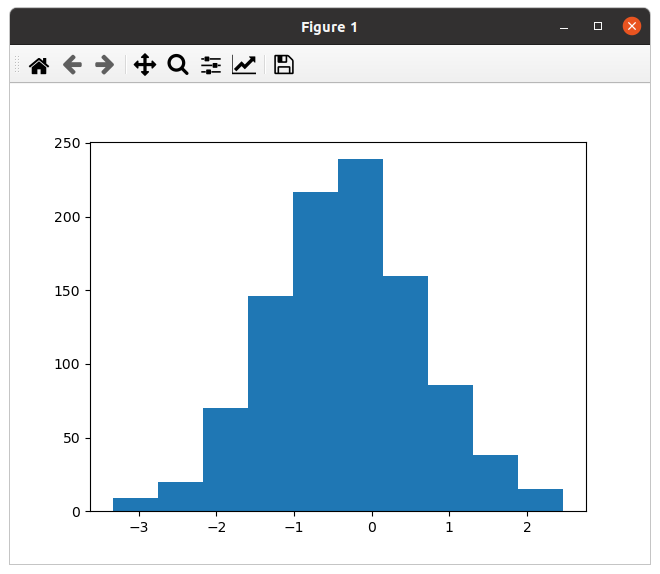
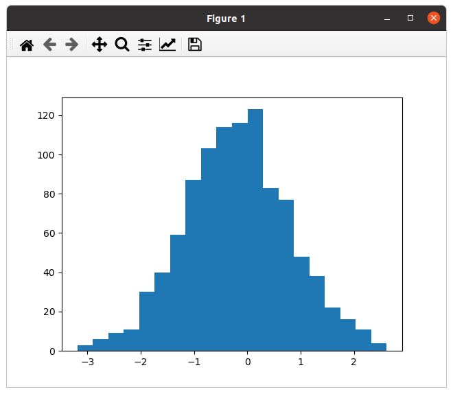

Managing runs
-------------

Qanat offers multiple way to know which runs have been done in the past. The first one is to use the ``qanat experiment status`` command:

.. code-block:: bash

   qanat experiment status histogram

that will produce:

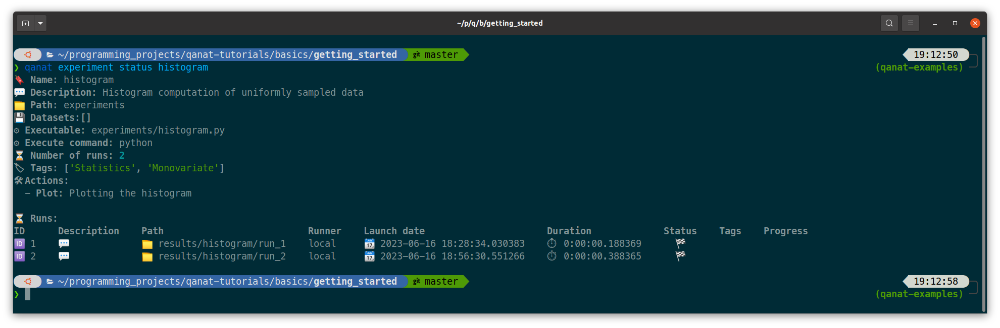

We can see that we have 2 runs. The first one is the one we did at the beginning of the tutorial. The second one is the one we did with the group.

.. note::
   Note that we didn't at this time but we can also associate description and tags to the runs. This can be done when running with options ``--description`` and ``--tags``. See ``qanat experiment run --help`` for more info on that.

The second way to know which runs have been done is to use the ``qanat experiment run_explore`` command:

.. code-block:: bash

   qanat experiment run_explore histogram

that will allow you to explore the runs thanks to either a menu or by a search function. The menu will look like:

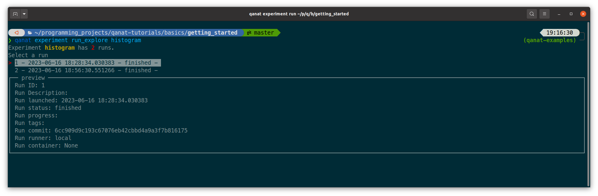

By pressing enter on a run, there are a few commands available:

.. image:: ../../_static/tutorials/basics/histogram/run_explore_menu_of_run.png
   :width: 700px
   :align: center

.. note::
   Note that the ``qanat experiment run_explore`` command can also be used to run an action on a run. This can be done by pressing the corresponding action in the menu.

Conclusion
----------

This tutorial has shown how to use Qanat to run an experiment and to analyse the results. We have seen how to add actions to the experiment and how to run the experiment with different parameters. We have also seen how to explore the results of the experiment.

There are many more features in Qanat that are not covered in this tutorial. Please refer to the documentation for more information.
